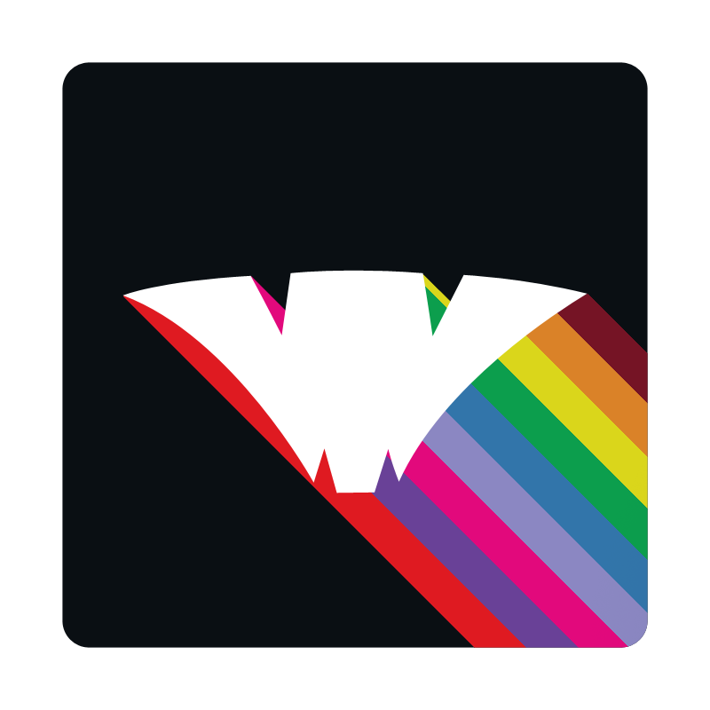
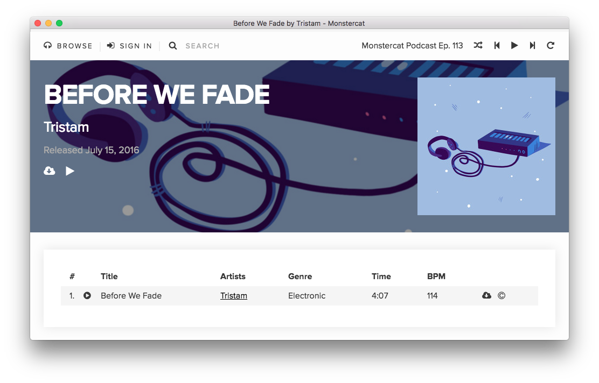

# Monstercat Connect (Deon) Desktop App
## Powered by (BadKitty)["http://badkitty.co"]

> DISCLAIMER: This is not an official project, and I am not affiliated with Monstercat.

## Description

The project was originally started by [Josh Balfour](https://github.com/joshbalfour/monstercat-connect-desktop-unofficial) but it used the old Connect client.

Monstercat has recently released what they call "Deon" and is a Connect client that anyone can use (even without a connect subscription!).

The desktop app ads features like media hotkey support. In the future, it will also support other cool things like push notifications (see roadmap).

## Downloads

You can download the first build of the app here:

* [OS X](https://github.com/joshbalfour/monstercat-connect-desktop-unofficial/releases/download/v0.1-alpha/OS.X.-.Unofficial.Monstercat.Connect.Desktop.dmg)

* [Windows](https://github.com/joshbalfour/monstercat-connect-desktop-unofficial/releases/download/v0.1-alpha/Windows.-.Unofficial.Monstercat.Connect.Desktop.Setup.exe)

* Linux - ~~Go compile it yourself, you're probably used to it anyway.~~ Binaries coming soon-ish.

## Roadmap

* Desktop notifications for new releases.

* MonstercatFM/ Podcast

* Notification Bar Support

## Ideas/Issues

You can use [the github issue tracker](https://github.com/joshbalfour/monstercat-connect-desktop-unofficial/issues/new) to report bugs or suggest features.

## Contributing

Feel free to contribute to the project. Just make a pull request and document the changes you made. 

## Credit

* [Josh Balfour](https://github.com/joshbalfour/monstercat-connect-desktop-unofficial) for the original project.

* /u/Smilesky for the app icon

* [This tweet](https://twitter.com/TheBlenderman49/status/738794652845940736) for the dmg background.

* Monstercat for the Connect Client

* Electron for the native wrapper.

## License

[MIT](license.md)
